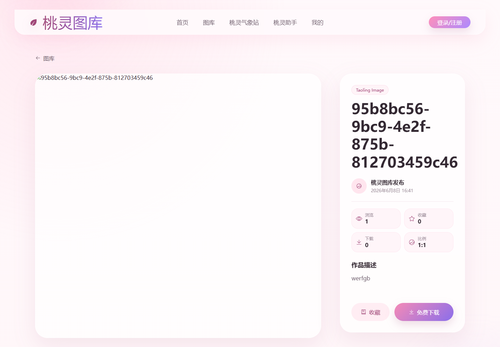
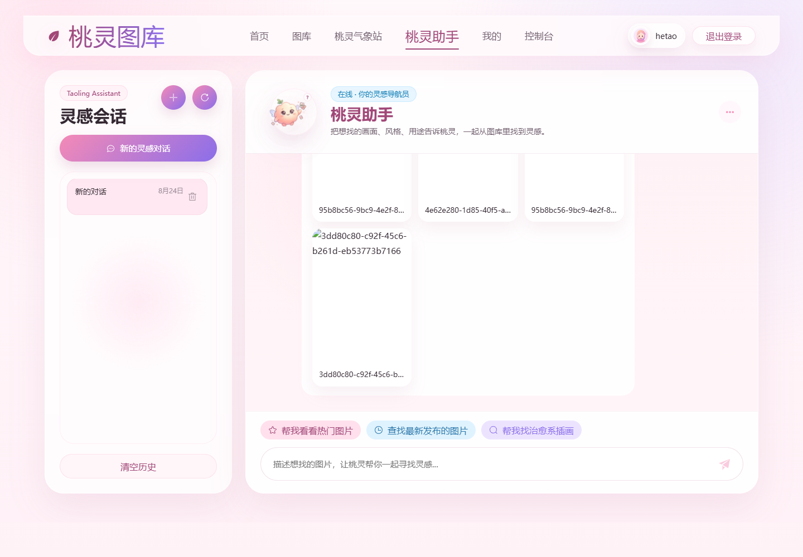
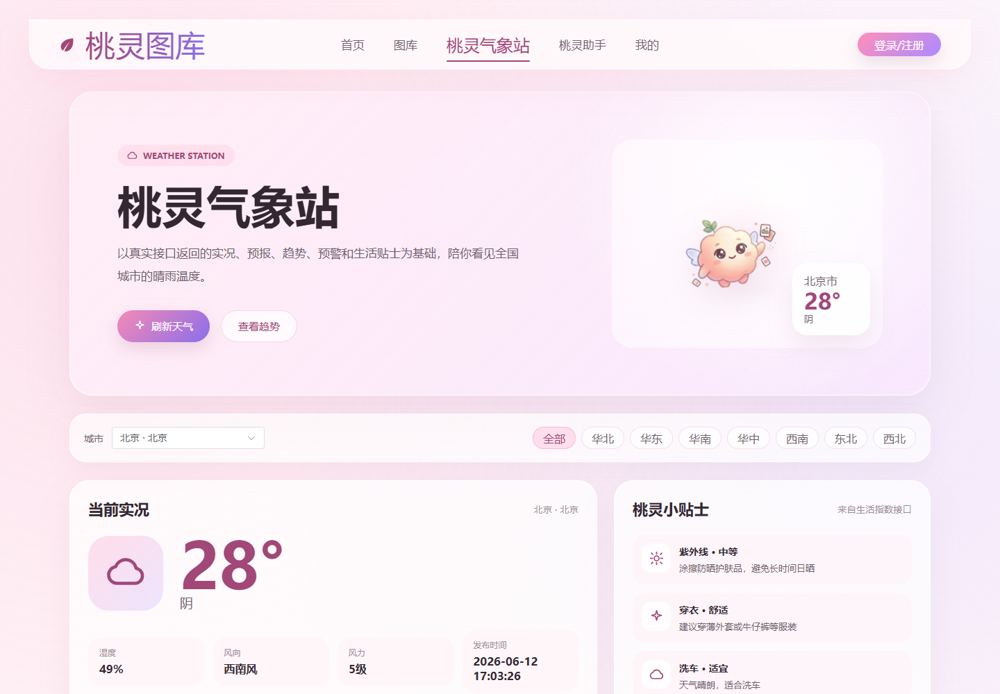
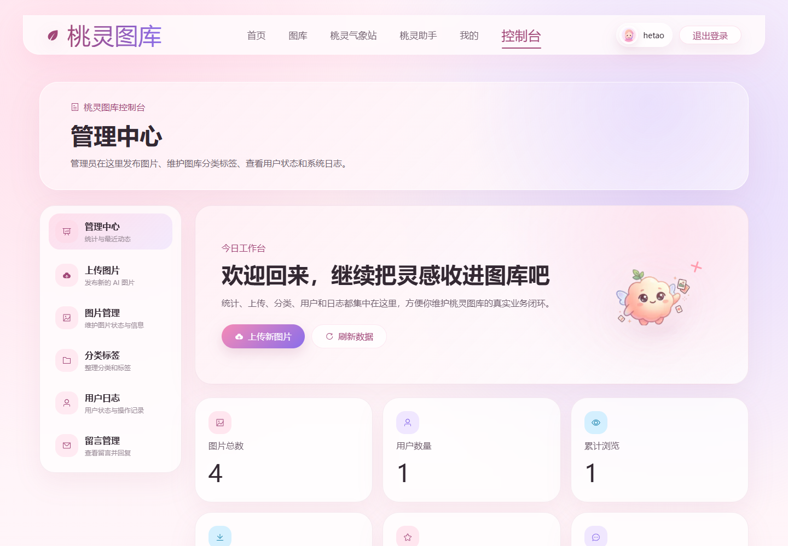
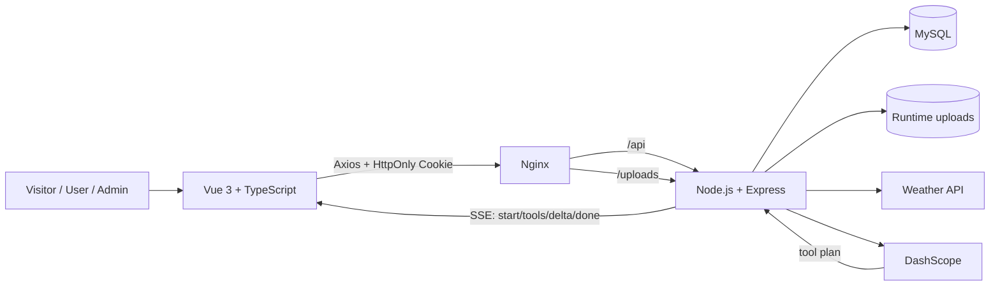

# Taoling Gallery / 桃灵图库

> 一个基于 Vue 3 + TypeScript 的前后端分离 AI 图片图库平台，覆盖图片检索与筛选、收藏下载、用户中心、管理后台、天气信息和可调用真实图库数据的桃灵助手。

[](./taoling-gallery)
[](./taoling-gallery)
[](./taoling-gallery-server)
[](./taoling-gallery-server/数据库文档.txt)

**Live Demo:** 暂未公开（预留域名当前不可访问） · **Demo GIF:** [桃灵助手真实图库查询](./docs/images/04-assistant.gif) · **Source:** [GitHub](https://github.com/heht0823-boop/taoling-project)

## Preview

| 首页与导航 | 图库筛选与分页 |
| --- | --- |
|  |  |
| 图片详情 | 桃灵助手 |
|  |  |
| 天气信息 | 管理后台 |
|  |  |

<details>
<summary>查看 15 秒交互 GIF：自然语言 → SSE → 后端图库工具 → 真实数据库结果</summary>


</details>

> 截图来自本地真实前后端联调。数据库记录存在，但生产 `uploads` 不在仓库中，因此本地列表对缺失缩略图使用了产品兜底状态；没有把运行时用户图片提交到 Git。

## Why this project

桃灵图库解决的是个人 AI 图片资产逐渐增多后，分散存储、难以检索、缺少用户交互和运营入口的问题。项目将“管理员发布与维护图片、访客发现图片、登录用户收藏下载、助手调用真实图库推荐”收敛成一条完整业务闭环，而不是为了展示技术栈而堆叠页面。

系统只有游客、普通用户和管理员三种访问状态，不包含用户投稿、关注、点赞、评论或创作者计划等社区业务。

## Core Features

- **Gallery：** 分类、标签、关键词、比例、排序、分页、详情和相关推荐。
- **User：** 注册登录、HttpOnly Cookie 鉴权、收藏、下载记录、资料与留言。
- **Admin：** 图片上传与状态管理、分类标签、用户、留言、统计和操作日志。
- **Image pipeline：** 原图与缩略图分离，Sharp 生成 WebP/AVIF 变体，静态资源长缓存。
- **Weather：** 高德天气 API、MySQL TTL 缓存、强制刷新、旧缓存和本地数据兜底。
- **Assistant：** SSE 流式回复；后端工具查询真实图库、返回真实图片 ID，并以确定性规则兜底。

## Architecture



前端数据流固定为 `apis → Pinia stores → views`。当前可运行后端是 Node.js/Express 基线；未来 FastAPI 重构必须遵守现有路径、字段、Cookie 和 SSE 事件契约，不能让前端跟随重写。详见 [架构说明](./docs/architecture.md) 与 [API 稳定契约](./docs/api-contract.md)。

| Layer | Technology | Responsibility |
| --- | --- | --- |
| Frontend | Vue 3, TypeScript, Vite, Pinia, Vue Router, Element Plus, SCSS | 页面、状态、路由、流式交互 |
| Backend | Node.js, Express, Sequelize | 鉴权、业务规则、图库工具、SSE、图片处理 |
| Data | MySQL, runtime uploads | 业务数据、天气缓存、原图与缩略图 |
| External | AMap Weather, DashScope | 天气数据与模型能力 |
| Delivery | Nginx, systemd, Alibaba Cloud | 反向代理、静态资源、服务守护 |

## Engineering Highlights

1. **发布覆盖运行时 uploads：** 从部署脚本定位到 `rm -rf src`，把上传目录迁出源码替换范围，形成“代码 / 配置 / 运行时数据分离”约束。[复盘](./docs/incidents/001-upload-overwritten.md) · [关键提交 `af5d037`](https://github.com/heht0823-boop/taoling-project/commit/af5d037)
2. **列表直接加载原图：** 通过原图、420/520px 变体、WebP/AVIF 和长缓存分离列表与详情载荷；上传文件不进入 Git。
3. **天气重复请求：** 增加实况/预报数据库 TTL 缓存、`refresh=true` 主动刷新和 stale/fallback 状态，外部服务失败时仍可解释地降级。[复盘](./docs/incidents/002-weather-cache.md) · [关键提交 `f361d1d`](https://github.com/heht0823-boop/taoling-project/commit/f361d1d)
4. **分页切换丢失选择：** 将已选标签对象从当前页 options 解耦为独立状态源，使切页、筛选和回显互不覆盖。[复盘](./docs/incidents/003-pagination-state.md) · [关键提交 `fb2c8f4`](https://github.com/heht0823-boop/taoling-project/commit/fb2c8f4)
5. **模型结果不可直接信任：** 助手由后端执行 `search_images` / `get_hot_images` / `get_latest_images` 等工具，模型只负责规划与表达；工具失败时使用确定性规则和真实数据库结果兜底。

## Local Development

### Prerequisites

- Node.js `20.19+` 或 `22.12+`
- MySQL 8.x
- npm 10+

### 1. Environment

```bash
cp taoling-gallery/.env.example taoling-gallery/.env.development
cp taoling-gallery-server/.env.example taoling-gallery-server/.env
```

必须在服务端 `.env` 中填写 `DB_PASSWORD`、`JWT_SECRET` 和 `ADMIN_PASSWORD`。高德、阿里云内容安全与 DashScope 配置按需启用；仓库只保留空值示例，不保留密钥。

数据库表结构参考 [数据库设计说明](./taoling-gallery-server/数据库文档.txt)，天气缓存表执行 [weather-cache-tables.sql](./taoling-gallery-server/docs/weather-cache-tables.sql)。当前 Node 基线尚未提供统一迁移命令，这是后续后端重构前需要补齐的可复现性缺口。

### 2. Start backend

```bash
cd taoling-gallery-server
npm ci
npm run dev
```

健康检查：`curl http://localhost:3000/health`

### 3. Start frontend

```bash
cd taoling-gallery
npm ci
npm run dev
```

默认访问：`http://localhost:5173/home`。开发接口地址必须与 `http://localhost:3000/api` 对齐；生产环境使用同源 `/api`。

## Deployment

目标拓扑为阿里云轻量应用服务器 + Nginx + systemd + MySQL。部署时只替换前端 `dist` 和后端代码，`.env` 留在服务器，`uploads` 保留在独立运行时目录并通过软链接挂载。

- [阿里云手工部署与回滚 runbook](./docs/deployment.md)
- [Nginx 配置](./ops/nginx/taoling-gallery.conf)
- [systemd 服务](./ops/systemd/taoling-gallery.service)
- [健康检查脚本](./ops/scripts/healthcheck.sh)

当前公开域名尚未通过可访问性验收，因此 README 不宣称线上 Demo 已可用。服务器验收完成后，再补充真实 `systemctl` / `curl` / Nginx 截图和完整演示视频链接。

## Engineering Records

- [架构与数据流](./docs/architecture.md)
- [前后端稳定 API 契约 / FastAPI 重构边界](./docs/api-contract.md)
- [部署、验收与回滚记录](./docs/deployment.md)
- [事故复盘目录](./docs/incidents/)
- [GitHub、简历和作品集介绍文案](./docs/project-profile.md)
- [当前 Node 基线后端文档](./taoling-gallery-server/docs/API.md)

`v1.0-node` 仅用于回溯当前 Node.js 可运行基线，不作为项目亮点。所有性能、用户量和并发结论都必须来自可复现测试；本仓库不使用无法验证的数字。
