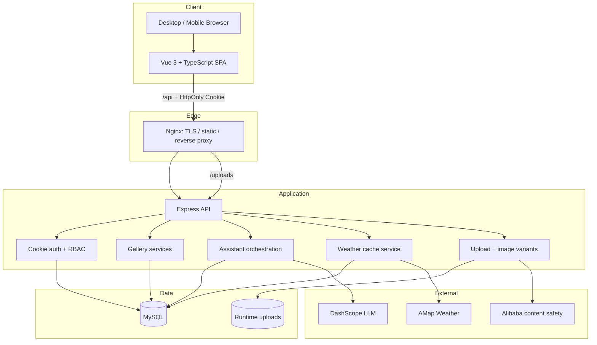
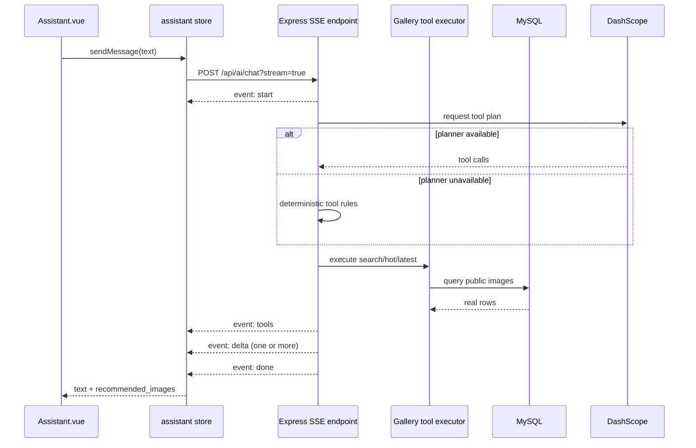

# 桃灵图库架构说明

## 1. Scope

桃灵图库是个人 AI 图片的发布、检索和交互平台。业务闭环限定为：管理员发布与维护图片；游客浏览、搜索和查看详情；登录用户收藏、下载、留言和使用桃灵助手；管理员查看统计、用户与操作日志。

系统不承载用户投稿、关注、粉丝、点赞、评论、打赏或创作者等级等社区关系。

## 2. Context diagram



## 3. Frontend boundaries

前端遵守固定依赖方向：

```text
views / components
        ↓
Pinia stores
        ↓
apis
        ↓
utils/request.ts
        ↓
HTTP / SSE
```

- `views` 只协调 UI 状态和调用 store action，不直接导入 Axios 或 API 模块。
- `stores` 负责业务状态、loading/error、分页和缓存。
- `apis` 只描述请求参数、路径和响应类型。
- `utils/request.ts` 统一处理 base URL、Cookie、业务错误和网络错误。
- 图片列表使用 `thumbnail_url`，详情页使用 `image_url`。

## 4. Backend modules

| Module | Main responsibility | Persistent data |
| --- | --- | --- |
| Auth / profile | 注册登录、Cookie、角色、用户资料 | users, user_stats |
| Gallery | 公开列表、详情、相关图片、分类标签 | images, categories, tags, image_tags |
| Interaction | 收藏、下载、浏览、留言 | favorites, download_records, image_view_records, user_messages |
| Admin | 图片、分类标签、用户、留言、统计与日志 | business tables, admin_logs |
| Image pipeline | Multer 上传、Sharp 变体、URL 生成 | runtime uploads, images |
| Weather | 外部天气、TTL 缓存、刷新与降级 | weather_live_cache, weather_forecast_cache |
| Assistant | 会话、SSE、工具规划、数据库查询、规则兜底 | ai_conversations, ai_messages, ai_memories |

## 5. Assistant request sequence



关键约束：模型不能直接声明图库里有什么；图片结果和 ID 必须来自后端工具查询。即使模型服务不可用，确定性规则仍能完成热门、最新、搜索和收藏意图的基本闭环。

## 6. Runtime ownership

```text
/opt/taoling-gallery/releases/<release-id>/   immutable release code
/opt/taoling-gallery/current -> releases/...  active release link
/etc/taoling-gallery/server.env               production configuration
/var/lib/taoling-gallery/uploads/             runtime user data
/var/log/taoling-gallery/                     service logs (or journald)
```

发布只创建新的 release 并切换 `current`；`.env` 和 `uploads` 不属于 release。当前 Node 代码期望后端目录存在 `uploads`，部署时用软链接把它指向 `/var/lib/taoling-gallery/uploads`。

## 7. Current and target state

- **Current runnable baseline:** Vue 3 frontend + Node.js/Express backend + MySQL.
- **Recorded baseline tag:** `v1.0-node`，仅用于重构回溯。
- **Target backend option:** FastAPI。只有在 [API 契约](./api-contract.md) 和回归测试覆盖后才能替换 Node 服务。
- **Target process manager:** systemd；仓库中旧 GitHub Actions/PM2 流程属于历史部署路径，迁移后应停用或改为调用同一发布脚本。

## 8. Architectural invariants

1. 运行时数据不能位于会被发布脚本删除的源码目录。
2. Cookie 名称、路径、SameSite/Secure 行为和 CORS 必须成组验证。
3. 分页响应固定包含 `list` 与 `pagination`，前端不能推测总页数。
4. 图片列表不得回退为原图直出。
5. 外部 API 失败必须返回可解释的 cache/fallback 状态。
6. AI 图片结果必须来自服务器工具和数据库，而不是模型自由生成。
